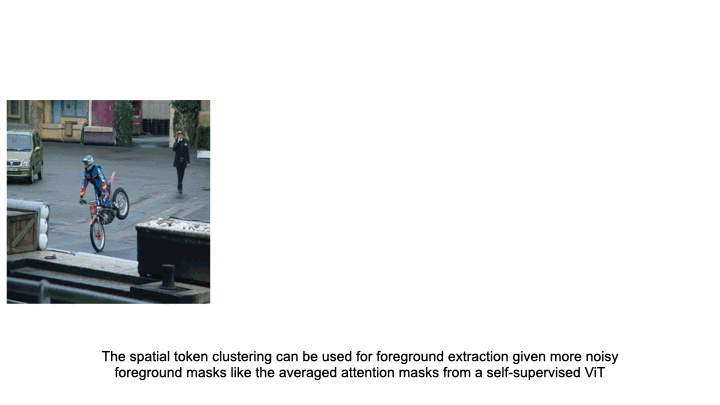

# [CVPR 2022] Leopart: Self-Supervised Learning of Object Parts for Semantic Segmentation 🐆

Pytorch implementation and pretrained models for Leopart. For more details refer to:
[[`arXiv`](https://arxiv.org/abs/2204.13101)][[`video`](https://www.youtube.com/watch?v=j1cOECMJMCI)]

<div>
  
</div>

### Pretrained Models

Below are links to our models pretrained with Leopart.
The full checkpoint contains the ViT backbone as well as the projection head.

<table>
  <tr>
    <th>arch</th>
    <th>params</th>
    <th>k=500</th>
    <th>linear</th>
    <th>fcn</th>
    <th colspan="3">download</th>
  </tr>
  <tr>
    <td>ViT-S/16</td>
    <td>21M</td>
    <td>53.5%</td>
    <td>69.3%</td>
    <td>71.4%</td>
    <td><a href="https://www.dropbox.com/s/0kjy61jh4i3vbnh/leopart_vits16.ckpt?dl=0">full ckpt</a></td>
    <td><a href="https://www.dropbox.com/s/zvu5l5n6nk9yfsv/leopart_vits16_pvoc_lin_head.ckpt?dl=0">linear head</a></td>
    <td><a href="https://www.dropbox.com/s/mvzvv4fdl7g1zhq/leopart_vits16_fcn_head.ckpt?dl=0">fcn head</a></td>
  </tr>
  <tr>
    <td>ViT-B/8</td>
    <td>85M</td>
    <td>59.7%</td>
    <td>-</td>
    <td>76.3%</td>
    <td><a href="https://www.dropbox.com/s/ieyuqfv8get50cy/leopart_vitb8.ckpt?dl=0">full ckpt</a></td>
    <td>-</td>
    <td><a href="https://www.dropbox.com/s/qxzrrubl5zo8lcp/leopart_vitb8_pvoc_fcn_head.ckpt?dl=0">fcn head</a></td>
  </tr>
</table>

To use Leopart embeddings on downstream dense prediction tasks, you just need to install `timm`  and `torch` and run:

```python
import torch
from timm.models.vision_transformer import vit_small_patch16_224, vit_base_patch8_224
path_to_checkpoint = "<your path to downloaded ckpt>"
model = vit_small_patch16_224()  # or vit_base_patch8_224() if you want to use our larger model
state_dict = torch.load(path_to_checkpoint)
model.load_state_dict({".".join(k.split(".")[1:]): v for k, v in state_dict.items()}, strict=False)
# Now you can call model.forward_features(batch) to get semantically rich image patch embeddings 
# of 16x16 (8x8) pixel each
```

### Fine-Tune with Leopart loss

<p align="center">
  
</p>

Fine-Tuning with Leopart does not require an immense GPU budget.
We used mostly two K80 or P40 GPUs for training.
Thus, Leopart is an easy win to make your ViT more spatially aware. For ImageNet-like data we already did the work for 
you - just download our pretrained models.
If you're working with different data, say satellite imagery or medical images, it is worth a try to fine-tune with Leopart
– especially if you have a lot of unlabelled data.
Note that you can change the config according to your needs. For fine-tuning on a new dataset, you'd have to 
change the data path, add a data module and initialize it in `finetune_with_leopart.py`.
In case you run into any problems or want to share ideas, feel free to 
[start a discussion](https://github.com/MkuuWaUjinga/leopart/discussions/new)!

If you want to reproduce our experiments you can use the configs in `experiment/configs/`. 
You just need to adapt the paths to your datasets and checkpoint directories accordingly.
An exemplary call to train on ImageNet-100 could look like this:
```
python experiments/finetune_with_leopart.py --config_path experiments/configs/train_in100k_config.yml
```
Also you can adjust parameters such as the number of gpus or the batch size using the config.

#### Evaluation: Overclustering
For overclustering evalaution we provide a script `sup_overcluster.py` under `experiments/overcluster`.
An exemplary call to evaluate a Leopart trained on ImageNet-100 on Pascal VOC could look like this:
```
python experiments/overcluster/sup_overcluster.py --config_path experiments/overcluster/configs/pascal/leopart-vits16-in.yml
```
Note that `sup_overcluster.py` can also be used to get fully unsupervised segmentation results by directly clustering to
K=21 classes in the case of Pascal VOC. Configs can be found under `./configs/pascal/k=21/`.

#### Evaluation: Linear and FCN
For linear and FCN fine-tuning we provide a script as well. All configs can be found in `experiments/linear_probing/configs/`. 
For FCN fine-tuning we provide configs under `./pascal/fcn/`.
An exemplary call to evaluate Leopart trained on COCO-Stuff could look like this:
```
python experiments/linear_probing/linear_finetune.py --config_path experiments/linear_probing/configs/coco_stuff/leopart-vits16-cc.yml
```
We also provide a script to evaluate on the validation dataset at `experiments/linear_probing/eval_linear.py`.
Exemplary calls can be found in `experiments/linear_probing/eval/eval_batch.sh`

### Fully unsupervised semantic segmentation
To show the expressiveness of our embeddings learnt, we tackle fully unsupervised semantic segmentation.

We run cluster-based foreground extraction as well as community detection as a novel, 
unsupervised way to create a many-to-one mapping from clusters to ground-truth objects.

To reproduce our results you can run 
```
python experiments/fully_unsup_seg/fully_unsup_seg.py --ckpt_path {vit-base-ckpt} --experiment_name vitb8 --arch vit-base --patch_size 8  --best_k 109 --best_mt 0.4 --best_et 0.07
```
```
python experiments/fully_unsup_seg/fully_unsup_seg.py --ckpt_path {vit-small-ckpt} --experiment_name vits16 --best_k 149 --best_mt 2 --best_et 0.09
```
for ViTB-8 and ViTS-16 respectively.

#### Cluster-Based Foreground Extraction
<p align="center">
  
</p>

#### Overclustering + Community Detection
<p align="center">
  
</p>

### Setup

#### Repo Structure
`src/`: Contains model, method and transform definitions 

`experiments/`: Contains all scripts to setup and run experiments. 

`data/`: Contains data modules for ImageNet, COCO, Pascal VOC and Ade20k

#### Environment
We use conda for dependency management. 
Please use `environment.yml` to replicate our environment for running the experiments.

#### Pythonpath
Export the module to PYTHONPATH with
`
export PYTHONPATH="${PYTHONPATH}:PATH_TO_REPO"
`
#### Neptune
We use neptune for logging experiments.
Get you API token for neptune and insert it in the corresponding run-files.
Also make sure to adapt the project name when setting up the logger.

#### Dataset Setup
The data is encapsulated in lightning data modules. 
Please download the data and organize as detailed in the next subsections.

##### Imagnet100k
The structure should be as follows:
```
dataset root.
│   imagenet100.txt
└───train
│   └─── n*
│       │   *.JPEG
│       │   ...
│   └─── n*
│    ...
```
The path to the dataset root is to be used in the configs.

##### COCO
The structure for training should be as follows:
```
dataset root.
└───images
│   └─── train2017
│       │   *.jpg
│       │   ...
```

The structure for evaluating on COCO-Stuff and COCO-Thing should be as follows:
```
dataset root.
└───annotations
│   └─── annotations
│       └─── stuff_annotations
│           │   stuff_val2017.json
│           └─── stuff_train2017_pixelmaps
│               │   *.png
│               │   ...
│           └─── stuff_val2017_pixelmaps
│               │   *.png
│               │   ...
│   └─── panoptic_annotations
│       │   panoptic_val2017.json
│       └─── semantic_segmenations_train2017
│           │   *.png
│           │   ...
│       └─── semantic_segmenations_val2017
│           │   *.png
│           │   ...
└───coco
│   └─── images
│       └─── train2017
│           │   *.jpg
│           │   ...
│       └─── val2017
│           │   *.jpg
│           │   ...
```
##### VOC Pascal
The structure for training and evaluation should be as follows:
```
dataset root.
└───SegmentationClass
│   │   *.png
│   │   ...
└───SegmentationClassAug # contains segmentation masks from trainaug extension 
│   │   *.png
│   │   ...
└───images
│   │   *.jpg
│   │   ...
└───sets
│   │   train.txt
│   │   trainaug.txt
│   │   val.txt
```

##### ADE20k
The structure for evaluation should be as follows:
```
dataset root.
└───ADE20K_2021_17_01
│    └───images
│       └───ADE
│           └───training
│               │   ...
│           └───validation
│               │   ...
│   │   index_ade20k.pkl
```
This follows the official structure as obtained by unzipping the downloaded dataset file.

